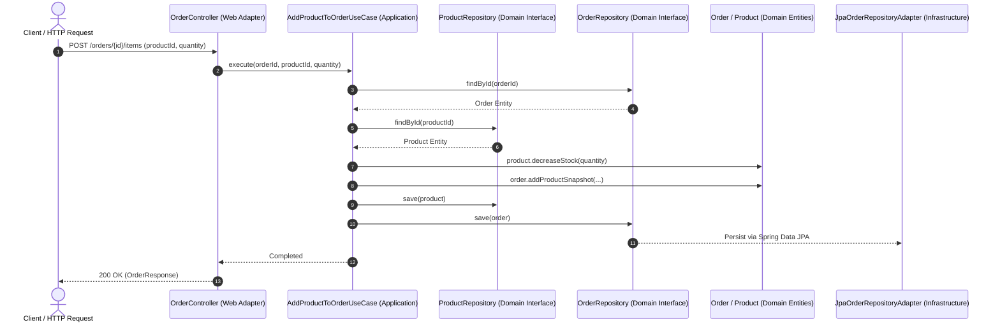

# 🏛️ Clean Architecture Example (Java 21 + Spring Boot 3)

[](https://oracle.com/java/)
[](https://spring.io/projects/spring-boot)
[](https://blog.cleancoder.com/uncle-bob/2012/08/13/the-clean-architecture.html)
[](src/test/java)

This repository is a **production-ready educational demonstration** showcasing the core principles of **Clean Architecture** (Uncle Bob) in a modern Java 21 & Spring Boot ecosystem.

The core goal of this project is to keep **business domain rules pure, framework-agnostic, and independent** of databases, HTTP controllers, and third-party libraries.

---

## 🎯 Architectural Principles & Highlights

- 🧠 **Pure & Rich Domain Model**: Business entities (`Product`, `Order`, `OrderItem`) protect their own invariants. No anemic models.
- 🔄 **Dependency Inversion Principle (DIP)**: Inner layers define repository interfaces; outer infrastructure layers implement them.
- 🎯 **Single Responsibility Use Cases**: Application flows (`CreateOrderUseCase`, `AddProductToOrderUseCase`, etc.) orchestrate single business actions.
- 🛡️ **ArchUnit Enforced Rules**: Automated tests verify that `domain` never depends on Spring, JPA, or outer layers.
- 📦 **Snapshot Preservation**: `OrderItem` captures a historical price/name snapshot of products, preventing future price updates from mutating existing order history.

---

## 🧱 Layered Architecture Diagram

```mermaid
    subgraph Outer ["Outermost Layers (Infrastructure & Adapters)"]
        WebController["Adapter: Web Controllers<br/>(ProductController, OrderController)"]
        JPAAdapter["Infrastructure: Persistence Adapters<br/>(JpaProductRepositoryAdapter, InMemoryProductRepository)"]
        DB[(External Persistence Mechanism<br/>MySQL / PostgreSQL / InMemory)]
    end

    subgraph Application ["Application Layer (Use Cases)"]
        UseCases["Use Cases<br/>(AddProductToOrderUseCase, CreateProductUseCase, etc.)"]
    end

    subgraph Domain ["Core Domain Layer (Framework Free)"]
        Entities["Entities & Value Objects<br/>(Product, Order, OrderItem, Status)"]
        RepoInterfaces["Repository Interfaces<br/>(ProductRepository, OrderRepository)"]
    end

    WebController -->|Invokes| UseCases
    UseCases -->|Coordinates| Entities
    UseCases -->|Uses| RepoInterfaces
    JPAAdapter -->|Implements| RepoInterfaces
    JPAAdapter -->|Reads / Writes| DB

    style Domain fill:#2d3748,stroke:#cbd5e0,color:#fff
    style Application fill:#1a202c,stroke:#a0aec0,color:#fff
    style Outer fill:#0d1117,stroke:#718096,color:#fff
```

### Request Flow Sequence



---

## 📦 Package & Project Structure

```text
src/main/java/com/example/clean_architecture_example/
├── adapter/
│   └── web/
│       ├── controller/             # REST API Controllers (thin HTTP handlers)
│       ├── dto/                    # Request & Response DTO records
│       ├── exception/              # GlobalExceptionHandler (Domain -> HTTP status mapping)
│       └── mapper/                 # Web DTO <-> Domain entity mappers
├── application/
│   └── usecase/
│       ├── order/                  # Application flows for Orders
│       └── product/                # Application flows for Products
├── config/
│   └── AppConfig.java              # Manual/Spring bean wiring
├── domain/
│   ├── entity/                     # Framework-agnostic Domain Entities
│   │   ├── Order.java
│   │   ├── OrderItem.java
│   │   ├── Product.java
│   │   └── enums/Status.java
│   ├── exception/                  # Domain-specific Exceptions
│   └── repository/                 # Domain Repository Interfaces
└── infrastructure/
    └── persistence/
        ├── entity/                 # Spring Data JPA Entities
        ├── inmemory/               # In-Memory Repository Implementations
        ├── jpa/adapter/            # Adapters implementing Domain Repositories
        ├── mapper/                 # Domain <-> JPA Entity mappers
        └── repository/             # Spring Data JPA Interfaces
```

---

## 🧪 Comprehensive Test Suite & ArchUnit Rules

The repository includes unit tests across domain and application layers, plus automated architectural integrity enforcement:

| Test Class | Layer | Purpose |
| :--- | :--- | :--- |
| **[CleanArchitectureRulesTest](src/test/java/com/example/clean_architecture_example/architecture/CleanArchitectureRulesTest.java)** | Architecture | Enforces with ArchUnit that `domain` has zero dependencies on Spring, JPA, or outer layers |
| **[ProductTest](src/test/java/com/example/clean_architecture_example/domain/entity/ProductTest.java)** | Domain | Validates price, stock bounds, status toggles, invariant protection |
| **[OrderTest](src/test/java/com/example/clean_architecture_example/domain/entity/OrderTest.java)** | Domain | Validates order status transitions, snapshot calculation, reconstitute logic |
| **[OrderItemTest](src/test/java/com/example/clean_architecture_example/domain/entity/OrderItemTest.java)** | Domain | Validates snapshot item quantity and total price calculation |
| **[AddProductToOrderUseCaseTest](src/test/java/com/example/clean_architecture_example/application/usecase/AddProductToOrderUseCaseTest.java)** | Application | Validates stock deduction, order update, and exception handling |
| **UseCase Test Templates** | Application | Unit test stubs for all 11 product and order application flows |

### Running the Tests

```bash
# Run all unit and architecture tests
./mvnw test
```

---

## 🚀 Running locally

### Prerequisites
- **Java 21+**
- **Maven 3.8+**
- **MySQL 8+** (Configured in `src/main/resources/application.properties`)

```bash
# Clone the repository
git clone https://github.com/eminyavuz/Clean-Architecture-Example.git
cd Clean-Architecture-Example

# Run the Spring Boot application
./mvnw spring-boot:run
```

---

## 💻 Interactive Web Console

Once the application is running, navigate to:

👉 **`http://localhost:8080/`**

An interactive admin-style web console is available to test product management, order creation, and stock updates visually.

---

## 📡 REST API Endpoint Documentation

### Product Endpoints

| Method | Endpoint | Description | Request Body |
| :--- | :--- | :--- | :--- |
| `POST` | `/products/create` | Create a new product | `CreateProductRequest` |
| `GET` | `/products` | List all products | None |
| `GET` | `/products/{id}` | Get product details by ID | None |
| `PUT` | `/products/{id}/price` | Update product price | `UpdateProductPriceRequest` |
| `PUT` | `/products/{id}/stock` | Update product stock | `UpdateProductStockRequest` |
| `PUT` | `/products/{id}/activate` | Activate product | None |
| `PUT` | `/products/{id}/deactivate` | Deactivate product | None |

### Order Endpoints

| Method | Endpoint | Description | Request Body |
| :--- | :--- | :--- | :--- |
| `POST` | `/orders/create` | Create a new empty order | None |
| `GET` | `/orders` | List all orders | None |
| `GET` | `/orders/{id}` | Get order details by ID | None |
| `POST` | `/orders/{id}/items` | Add product snapshot to order | `AddProductToOrderRequest` |
| `POST` | `/orders/{id}/start` | Transition order status to `ON_PROGRESS` | None |

---

## ⚠️ Exception Handling & HTTP Status Code Mapping

Domain exceptions are framework-agnostic and automatically translated to standard HTTP error responses via **`GlobalExceptionHandler`**:

| Domain Exception | HTTP Status | Error Code |
| :--- | :--- | :--- |
| `ProductNotFoundException` | `404 NOT FOUND` | `PRODUCT_NOT_FOUND` |
| `OrderNotFoundException` | `404 NOT FOUND` | `ORDER_NOT_FOUND` |
| `NotEnoughStockException` | `409 CONFLICT` | `NOT_ENOUGH_STOCK` |
| `ProductNotActiveException` | `400 BAD REQUEST` | `PRODUCT_NOT_ACTIVE` |
| `IllegalArgumentException` | `400 BAD REQUEST` | `VALIDATION_ERROR` |
| `IllegalStateException` | `400 BAD REQUEST` | `VALIDATION_ERROR` |

---

## 📜 License

This project is open-source and available under the **MIT License**. Feel free to use it as a reference for educational projects, articles, or talks!
